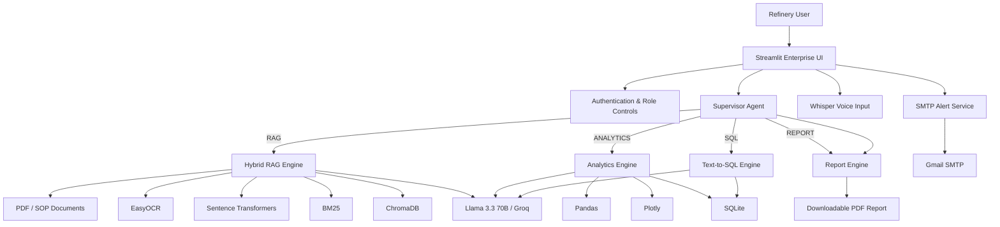

# ⛽ IOCL Enterprise Refinery Copilot

> **Enterprise-oriented AI assistant for refinery operations, SOP knowledge, operational analytics, and compliance workflows.**

IOCL Enterprise Refinery Copilot is a multimodal AI platform designed around the information and analytics needs of refinery personnel. It combines **LLM-based intent routing, hybrid RAG search, OCR, CSV/Excel analytics, natural-language SQL, voice interaction, role-aware controls, source citations, PDF report generation, and operational email alerts** inside a Streamlit application.

The system is designed as an extensible prototype for an industrial environment where users may need to move between unstructured refinery documentation and structured operational data without switching between multiple tools.

---

## ✨ Key Capabilities

### 🤖 AI Supervisor & Intent Routing

A dedicated `SupervisorAgent` uses **Llama 3.3 70B through Groq** to classify incoming requests into four execution pathways:

- **RAG** — SOPs, manuals, safety guidance, equipment documentation, and policy knowledge
- **ANALYTICS** — CSV/Excel operational-log analysis and visualizations
- **SQL** — natural-language questions over structured operational data
- **REPORT** — report and PDF-oriented requests

The supervisor returns a unified response structure containing the answer, citations, visualization, SQL output, and execution metadata.

### 📚 Hybrid RAG Knowledge System

The RAG engine combines multiple retrieval techniques rather than relying on vector similarity alone:

- PDF text extraction with **pypdf**
- **EasyOCR** fallback for scanned pages
- English + Hindi OCR support
- Sliding-window document chunking
- **Sentence Transformers** embeddings using `all-MiniLM-L6-v2`
- **ChromaDB** persistent vector storage
- **BM25** keyword retrieval
- **Reciprocal Rank Fusion (RRF)** to combine keyword and semantic rankings
- Document metadata including filename, page, and version
- Source citations returned with generated answers
- Conversation-history context for recent turns

This allows the Copilot to answer document-based questions while retaining traceability to the retrieved source material.

### 📊 Operational Data Analytics

The analytics engine accepts **CSV and Excel** operational logs and provides:

- Pandas-based data processing
- Natural-language analytical queries
- Automatically generated Plotly visualizations
- Trend, comparison, and parameter analysis
- Automatic synchronization of loaded datasets into an in-memory SQLite table

The LLM generates the analysis code and the application executes it against the loaded DataFrame to produce a textual summary and optional Plotly figure.

### 🗄️ Natural-Language SQL

Users can ask database-style questions in plain English instead of writing SQL manually.

The SQL workflow:

1. Detects an SQL-oriented request.
2. Determines the available schema.
3. Uses Llama 3.3 70B to generate SQL.
4. Executes the generated query against SQLite.
5. Returns structured records and an operational explanation.

The prompt instructs the model to generate **read-only SELECT queries**.

### 🎙️ Voice Interaction

The application supports microphone-based operational queries using **OpenAI Whisper** for local speech transcription. This is intended for hands-free interaction scenarios where typing is inconvenient.

### 🌐 Multilingual Support

The current interface provides response-language selection for:

- English
- Hindi (हिन्दी)

The OCR pipeline also supports English and Hindi technical text.

### 🔐 Authentication, RBAC & Administration

The application includes:

- Streamlit authentication
- Session-based login state
- Role selection for Operator, Engineer, Admin, HR, and Intern workflows
- Restricted document-upload controls for lower-privilege roles
- Admin/Engineer access to system analytics
- Feedback audit trail
- Document versioning audit view

### 📄 Automated PDF Reports

Copilot responses can be exported as formal PDF compliance reports containing:

- Report title
- Executive summary / response
- Source citations
- Document page references
- Source version information

PDF generation is handled through **ReportLab**.

### 🚨 Enterprise Safety & Email Alerts

The admin dashboard includes an operational alert workflow that can send safety/compliance notifications through **Gmail SMTP**.

Alerts include:

- Recipient email
- Alert subject
- Alert details
- `[IOCL COPILOT ALERT]` subject prefix

Credentials are loaded through environment variables rather than being stored directly in the application source.

---

## 🧠 System Architecture



---

## 🏗️ Project Structure

```text
IOCL Enterprise Refinery Copilot/
│
├── agents/
│   └── supervisor.py              # LLM intent classification & orchestration
│
├── core/
│   ├── analytics_engine.py        # Pandas + Plotly analytics + Text-to-SQL
│   ├── rag_engine.py              # Hybrid RAG, OCR, embeddings & retrieval
│   ├── report_engine.py           # PDF compliance report generation
│   └── sql_excel_engine.py        # CSV/Excel + SQLite natural-language SQL
│
├── modules/
│   ├── rbac_admin.py              # RBAC/admin utilities
│   └── voice_feedback.py          # Whisper voice input & feedback UI
│
├── data/
│   └── emp.csv                    # Sample structured data
│
├── temp_pdfs/                     # Sample/reference documents
├── app.py                         # Main Streamlit application
├── config.example.yaml            # Safe configuration template
├── config.py                      # Configuration utilities
├── requirements.txt               # Python dependencies
└── README.md
```

> Local runtime artifacts such as `.env`, ChromaDB storage, Python caches, and other generated files should remain outside version control.

---

## 🛠️ Technology Stack

| Layer | Technologies |
|---|---|
| **Frontend / UI** | Streamlit |
| **LLM** | Llama 3.3 70B via Groq |
| **LLM Orchestration** | LangChain / custom Supervisor Agent |
| **RAG** | ChromaDB, BM25, Sentence Transformers, Reciprocal Rank Fusion |
| **Document Processing** | pypdf, EasyOCR, Pillow |
| **Embeddings** | `all-MiniLM-L6-v2` |
| **Analytics** | Pandas, Plotly |
| **Structured Querying** | SQLite, natural-language-to-SQL |
| **Voice** | OpenAI Whisper |
| **Reports** | ReportLab |
| **Authentication** | streamlit-authenticator, PyYAML |
| **Email Alerts** | Python SMTP / Gmail SMTP |
| **Configuration** | `.env` + YAML |
| **Language Support** | English + Hindi |

---

## 🔄 Typical Workflow

### 1. Document Question

```text
User question
    ↓
Supervisor Agent
    ↓
RAG classification
    ↓
BM25 + Vector Search
    ↓
Reciprocal Rank Fusion
    ↓
Top document chunks
    ↓
Llama 3.3 70B
    ↓
Answer + citations
```

### 2. Operational Analytics

```text
CSV / Excel upload
    ↓
Pandas DataFrame
    ↓
Supervisor → ANALYTICS
    ↓
LLM-generated analysis code
    ↓
Pandas execution
    ↓
Plotly visualization + summary
```

### 3. Natural-Language SQL

```text
Natural-language question
    ↓
Supervisor → SQL
    ↓
Schema-aware SQL generation
    ↓
SQLite execution
    ↓
Structured records
    ↓
Operational explanation
```

---

## 🚀 Local Setup

### Prerequisites

- Python 3.12+ recommended
- Git
- A Groq API key
- Gmail App Password if SMTP alerts are enabled

### 1. Clone the repository

```bash
git clone https://github.com/aaravsharma1211/iocl-refinery-copilot.git
cd iocl-refinery-copilot
```

### 2. Create a virtual environment

**Windows PowerShell:**

```powershell
python -m venv .venv
.\.venv\Scripts\Activate.ps1
```

### 3. Install dependencies

```powershell
pip install -r requirements.txt
```

### 4. Configure authentication

Copy the example configuration:

```powershell
Copy-Item config.example.yaml config.yaml
```

Edit `config.yaml` with your local authentication configuration.

### 5. Configure environment variables

Create a local `.env` file:

```env
GROQ_API_KEY=your_groq_api_key
ALERT_EMAIL=your_sender_gmail@gmail.com
ALERT_EMAIL_PASSWORD=your_16_character_google_app_password
```

**Never commit `.env` or real credentials to GitHub.**

### 6. Start the application

```powershell
streamlit run app.py
```

The application will be available at the local Streamlit URL shown in the terminal.

---

## 🔒 Security Notes

This repository is intended as an **academic / internship project prototype**, not as a production refinery control system.

Before production deployment, the following should be strengthened:

- Use a dedicated secret manager instead of local environment files.
- Replace UI-level role selection with server-side authorization tied to authenticated identities.
- Add strict SQL parsing/validation before execution.
- Sandbox LLM-generated Python analytics code instead of executing it directly with `exec`.
- Add persistent audit logging with controlled access.
- Add CSRF/session-hardening and enterprise identity integration.
- Add comprehensive automated tests and dependency scanning.
- Deploy behind HTTPS with appropriate network controls.

---

## 📈 Future Enhancements

Planned directions for turning the prototype into a larger industrial AI platform include:

- **Live IoT / sensor integration** for refinery equipment telemetry
- **Predictive maintenance models** for equipment failure prediction
- **Digital-twin integration** with refinery asset states
- **Streaming event processing** for real-time anomaly detection
- **Enterprise SSO** and fine-grained permissions
- **Persistent audit and compliance database**
- **Agentic maintenance workflows** with approval gates
- **Multimodal document understanding** for diagrams, tables, and engineering drawings
- **More Indian-language support** for field operators
- **Containerized deployment** with Docker and cloud/on-premise deployment options
- **Automated evaluation** for RAG retrieval quality, answer grounding, and SQL accuracy
- **Monitoring and observability** for latency, errors, model usage, and operational workflows

---

## 🎯 Project Objective

The central objective of IOCL Enterprise Refinery Copilot is to provide a **single AI-assisted operational interface** where refinery personnel can interact with documents, operational data, analytics, and compliance workflows using natural language.

Instead of treating document search, data analysis, reporting, and operational communication as separate applications, the project demonstrates how these capabilities can be orchestrated through a common AI interface.

---

## ⚠️ Disclaimer

This project is an **internship / academic prototype** developed for demonstrating enterprise AI, RAG, analytics, automation, and refinery-domain application concepts. It is not intended to replace approved refinery procedures, safety systems, engineering judgment, or authorized operational controls.

---

## 👨‍💻 Author

**Aarav Sharma**  
Computer Science & Engineering — AI/ML

**Repository:** [IOCL Enterprise Refinery Copilot](https://github.com/aaravsharma1211/iocl-refinery-copilot)

---

## ⭐ If You Find This Project Interesting

Feel free to explore the architecture, experiment with the retrieval and analytics pipelines, and extend the platform toward real-time industrial AI and predictive-maintenance workflows.
